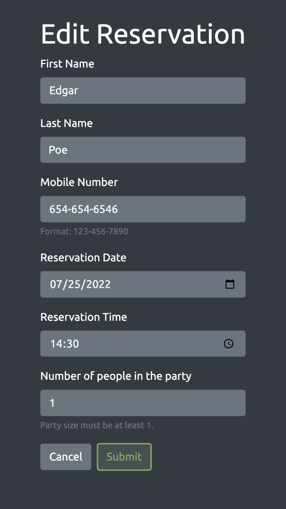

# Periodic Tables: Restaurant Reservation System

Periodic Tables is a web application which can be used by restaurants to track reservations and table seating status. The app allows for creation of new tables, creation and editing of reservations, and the ability to 'seat' and 'unseat' reservations at specific tables.

> ### Deployed app: [Periodic Tables](https://restaurant-reservation-app-kappa.vercel.app/dashboard)

## Design

### Desktop

&nbsp;&nbsp;&nbsp;&nbsp;&nbsp;

### Tablet

### Mobile

&nbsp;&nbsp;&nbsp;&nbsp;&nbsp;&nbsp;&nbsp;&nbsp;&nbsp;

### Additional Pages

&nbsp;&nbsp;&nbsp;&nbsp;&nbsp;&nbsp;&nbsp;&nbsp;&nbsp;

## API

Visit [API documentation](./back-end//README.md) for detailed instructions.

## Technologies
> *Technologies used in this app*

### Frontend:
- [Javascript](http://knexjs.org/)
- [React](http://knexjs.org/)
- [Bootstrap](http://knexjs.org/)
- [HTML5](http://knexjs.org/)
- [CSS](http://knexjs.org/)

### Backend:
- [Node](http://knexjs.org/)
- [Express](http://knexjs.org/)
- [Knex](http://knexjs.org/)
- [PostgreSQL](http://knexjs.org/)

## Installation

1. Fork and clone this repository.
1. Run `cp ./back-end/.env.sample ./back-end/.env`.
1. Update the `./back-end/.env` file with the connection URL's to your database instance.
1. Run `cp ./front-end/.env.sample ./front-end/.env`.
1. Run `npm install` to install project dependencies.
1. Run `npm run start:dev` to start your server in development mode.

